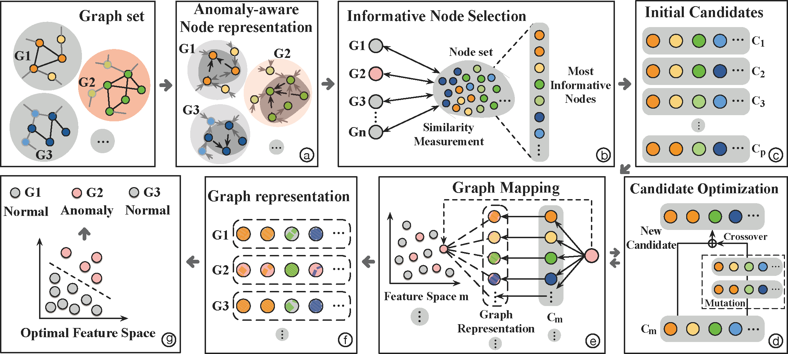

  
   

<h1> Towards Graph-level anomaly detection via deep evolutionary mapping </h1>

Open-sourced implementation for ICLR2023 Submission - GmapAD.

GmapAD is a graph-level anomaly detection framework with specially designed explainable graph mapping that maps graphs into a latent space where anomalies can be effectively detected. GmapAD's framework is shown as above.

<h2> Python Dependencies </h2>

Our proposed GmapAD framework is implemented in Python 3.7 and major libraries include: 

* [Pytorch](https://pytorch.org/) = 1.11.0+cu102
* [PyG] (https://pytorch-geometric.readthedocs.io/en/latest/) torch-geometric=2.1.0

More dependencies are provided in requirements.txt.

<h2> To Run </h2>

`python src/main.py`

<h2> Datasets </h2>

All datasets used in this paper are from previous works and the brain network datasets can be downloaded from [BrainNetDatasets](https://github.com/GRAND-Lab/graph\_datasets) and graph classification datasets can be downloaded from [GraphClsDatasets](https://chrsmrrs.github.io/datasets/).

<h2> Experimental Results </h2>

| **Precision** | **GCN** | **GAT** | **g-U-Nets** | **DiffPool** | **SAGPool** | **GMT**  | **OCGIN** | **OCGLT** | **GmapAD-GCN** | **GmapAD-GAT** |
|:-----------------:|:----------------:|:----------------:|:---------------------:|:---------------------:|:--------------------:|:-----------------:|:------------------:|:------------------:|:-----------------------:|:-----------------------:|
| KKI               | 0.53 $\pm$ 0.3     | 0.54 $\pm$ 0.3     | 0.38 $\pm$ 0.2          | 0.46 $\pm$ 0.1          | 0.36 $\pm$ 0.2         | 0.46 $\pm$ 0.2      | 0.40 $\pm$ 0.2       | 0.43 $\pm$ 0.2       | 0.63 $\pm$ 0.3            | **0.67 $\pm$ 0.4**       |
| OHSU              | 0.58 $\pm$ 0.3     | 0.55 $\pm$ 0.2     | 0.51 $\pm$ 0.3          | 0.48 $\pm$ 0.2          | 0.46 $\pm$ 0.2         | 0.43 $\pm$ 0.2      | 0.57 $\pm$ 0.1       | 0.64 $\pm$ 0.2       | 0.59 $\pm$ 0.1            | **0.66 $\pm$ 0.2**       |
| AIDS              | 0.97 $\pm$ 0.1     | 0.97 $\pm$ 0.1     | 0.97 $\pm$ 0.1          | 0.97 $\pm$ 0.1          | 0.92 $\pm$ 0.1         | **0.98 $\pm$ 0.3** | 0.96 $\pm$ 0.1       | 0.96 $\pm$ 0.2       | **0.98 $\pm$ 0.1**       | **0.98 $\pm$ 0.1**       |
| MUTAG             | 0.83 $\pm$ 0.2     | 0.77 $\pm$ 0.3     | 0.88 $\pm$ 0.1          | 0.75 $\pm$ 0.1          | 0.80 $\pm$ 0.1         | 0.79 $\pm$ 0.1      | 0.59 $\pm$ 0.1       | 0.72 $\pm$ 0.1       | **0.93 $\pm$ 0.3**   | 0.84 $\pm$ 0.2            |
| Mutagenicity      | 0.87 $\pm$ 0.1     | 0.88 $\pm$ 0.1     | 0.88 $\pm$ 0.1          | 0.72 $\pm$ 0.1          | 0.88 $\pm$ 0.1         | 0.90 $\pm$ 0.1      | 0.89 $\pm$ 0.2       | 0.88 $\pm$ 0.1       | 0.90 $\pm$ 0.1            | **0.91 $\pm$ 0.1**       |
| NCI1              | 0.88 $\pm$ 0.3     | 0.87 $\pm$ 0.2     | 0.89 $\pm$ 0.1          | 0.61 $\pm$ 0.1          | 0.91 $\pm$ 0.1         | 0.91 $\pm$ 0.1      | 0.90 $\pm$ 0.1       | 0.92 $\pm$ 0.1       | **0.93 $\pm$ 0.2**       | **0.93 $\pm$ 0.3**       |
| PROTEINS          | 0.87 $\pm$ 0.1     | 0.85 $\pm$ 0.2     | 0.87 $\pm$ 0.3          | 0.75 $\pm$ 0.1          | 0.87 $\pm$ 0.1         | 0.88 $\pm$ 0.1      | 0.85 $\pm$ 0.1       | 0.86 $\pm$ 0.2       | **0.89 $\pm$ 0.1**   | 0.87 $\pm$ 0.2            |
| IMDB-BINARY       | 0.91 $\pm$ 0.1     | 0.87 $\pm$ 0.3     | 0.94 $\pm$ 0.1          | 0.76 $\pm$ 0.1          | 0.90 $\pm$ 0.1         | 0.93 $\pm$ 0.1      | 0.93 $\pm$ 0.1       | 0.88 $\pm$ 0.1       | **0.98 $\pm$ 0.1**       | 0.92 $\pm$ 0.1            |
| REDDIT-BINARY     | 0.88 $\pm$ 0.1     | 0.85 $\pm$ 0.1     | 0.89 $\pm$ 0.1          | 0.74 $\pm$ 0.1          | 0.91 $\pm$ 0.1         | **0.93 $\pm$ 0.2** | 0.83 $\pm$ 0.1       | 0.89 $\pm$ 0.1       | **0.93 $\pm$ 0.1**       | 0.91 $\pm$ 0.1            |

| **Recall** | **GCN** | **GAT** | **g-U-Nets** | **DiffPool** | **SAGPool** | **GMT** | **OCGIN** | **OCGLT** | **GmapAD-GCN** | **GmapAD-GAT** |
|:-----------------:|:----------------:|:----------------:|:---------------------:|:---------------------:|:--------------------:|:----------------:|:------------------:|:------------------:|:-----------------------:|:-----------------------:|
| KKI               | 0.35 $\pm$ 0.1     | 0.62 $\pm$ 0.4     | 0.32 $\pm$ 0.1          | 0.46 $\pm$ 0.1          | 0.68 $\pm$ 0.5         | 0.83 $\pm$ 0.4     | 0.38 $\pm$ 0.2       | 0.42 $\pm$ 0.2       | **0.83 $\pm$ 0.3**       | 0.80 $\pm$ 0.4            |
| OHSU              | 0.70 $\pm$ 0.2     | 0.49 $\pm$ 0.2     | 0.45 $\pm$ 0.4          | 0.49 $\pm$ 0.2          | 0.65 $\pm$ 0.2         | 0.68 $\pm$ 0.4     | 0.57 $\pm$ 0.1       | 0.62 $\pm$ 0.2       | **0.82 $\pm$ 0.2**       | 0.64 $\pm$ 0.2            |
| AIDS              | 0.58 $\pm$ 0.1     | 0.72 $\pm$ 0.1     | 0.73 $\pm$ 0.2          | 0.93 $\pm$ 0.1          | 0.82 $\pm$ 0.1         | **1.0 $\pm$ 0.0** | 0.49 $\pm$ 0.1       | 0.97 $\pm$ 0.1       | 0.99 $\pm$ 0.1            | 0.99 $\pm$ 0.1            |
| MUTAG             | 0.82 $\pm$ 0.2     | 0.61 $\pm$ 0.1     | 0.85 $\pm$ 0.1          | 0.80 $\pm$ 0.1          | 0.82 $\pm$ 0.1         | 0.76 $\pm$ 0.1     | 0.36 $\pm$ 0.1       | 0.73 $\pm$ 0.1       | **0.95 $\pm$ 0.3**       | 0.89 $\pm$ 0.2            |
| Mutagenicity      | 0.71 $\pm$ 0.1     | 0.79 $\pm$ 0.1     | 0.95 $\pm$ 0.2          | 0.74 $\pm$ 0.1          | 0.95 $\pm$ 0.1         | 0.95 $\pm$ 0.1     | 0.49 $\pm$ 0.1       | 0.88 $\pm$ 0.1       | **0.98 $\pm$ 0.1**       | **0.98 $\pm$ 0.1**       |
| NCI1              | 0.75 $\pm$ 0.3     | 0.78 $\pm$ 0.1     | 0.96 $\pm$ 0.1          | 0.58 $\pm$ 0.1          | 0.95 $\pm$ 0.1         | 0.98 $\pm$ 0.1     | 0.48 $\pm$ 0.1       | 0.92 $\pm$ 0.1       | **0.99 $\pm$ 0.1**       | **0.99 $\pm$ 0.1**       |
| PROTEINS          | 0.57 $\pm$ 0.1     | 0.64 $\pm$ 0.4     | 0.71 $\pm$ 0.1          | 0.68 $\pm$ 0.1          | 0.92 $\pm$ 0.1         | 0.95 $\pm$ 0.1     | 0.48 $\pm$ 0.1       | 0.87 $\pm$ 0.1       | **0.99 $\pm$ 0.1**       | 0.97 $\pm$ 0.2            |
| IMDB-BINARY       | 0.70 $\pm$ 0.1     | 0.85 $\pm$ 0.3     | 0.98 $\pm$ 0.1          | 0.77 $\pm$ 0.1          | 0.98 $\pm$ 0.1         | 0.95 $\pm$ 0.1     | 0.98 $\pm$ 0.1       | 0.89 $\pm$ 0.1       | **0.99 $\pm$ 0.1**       | 0.94 $\pm$ 0.1            |
| REDDIT-BINARY     | 0.83 $\pm$ 0.1     | 0.92 $\pm$ 0.1     | 0.78 $\pm$ 0.2          | 0.68 $\pm$ 0.1          | 0.91 $\pm$ 0.1         | 0.93 $\pm$ 0.1     | 0.45 $\pm$ 0.1       | 0.89 $\pm$ 0.1       | 0.94 $\pm$ 0.1            | **0.96 $\pm$ 0.1**       |

| **F1-Score** | **GCN** | **GAT** | **g-U-Nets** | **DiffPool** | **SAGPool** | **GMT**  | **OCGIN** | **OCGLT** | **GmapAD-GCN** | **GmapAD-GAT** |
|:-----------------:|:----------------:|:----------------:|:---------------------:|:---------------------:|:--------------------:|:-----------------:|:------------------:|:------------------:|:-----------------------:|:-----------------------:|
| KKI               | 0.36 $\pm$ 0.2     | 0.56 $\pm$ 0.3     | 0.34 $\pm$ 0.1          | 0.44 $\pm$ 0.1          | 0.46 $\pm$ 0.3         | 0.58 $\pm$ 0.3      | 0.38 $\pm$ 0.2       | 0.43 $\pm$ 0.2       | 0.71 $\pm$ 0.3            | **0.73 $\pm$ 0.3**       |
| OHSU              | 0.59 $\pm$ 0.2     | 0.51 $\pm$ 0.2     | 0.36 $\pm$ 0.3          | 0.47 $\pm$ 0.2          | 0.51 $\pm$ 0.2         | 0.51 $\pm$ 0.3      | 0.57 $\pm$ 0.1       | 0.61 $\pm$ 0.2       | **0.68 $\pm$ 0.7**       | 0.63 $\pm$ 0.2            |
| AIDS              | 0.73 $\pm$ 0.1     | 0.83 $\pm$ 0.1     | 0.83 $\pm$ 0.1          | 0.98 $\pm$ 0.1          | 0.86 $\pm$ 0.1         | **1.0 $\pm$ 0.0**  | 0.65 $\pm$ 0.1       | 0.96 $\pm$ 0.1       | 0.99 $\pm$ 0.1            | 0.99 $\pm$ 0.1            |
| MUTAG             | 0.86 $\pm$ 0.1     | 0.75 $\pm$ 0.1     | 0.82 $\pm$ 0.1          | 0.83 $\pm$ 0.1          | 0.81 $\pm$ 0.1         | 0.78 $\pm$ 0.1      | 0.44 $\pm$ 0.1       | 0.71 $\pm$ 0.2       | **0.96 $\pm$ 0.3**   | 0.86 $\pm$ 0.1            |
| Mutagenicity      | 0.81 $\pm$ 0.1     | 0.87 $\pm$ 0.1     | 0.92 $\pm$ 0.1          | 0.72 $\pm$ 0.1          | 0.91 $\pm$ 0.1         | 0.92 $\pm$ 0.1      | 0.63 $\pm$ 0.1       | 0.87 $\pm$ 0.2       | **0.94 $\pm$ 0.1**       | **0.94 $\pm$ 0.1**       |
| NCI1              | 0.84 $\pm$ 0.3     | 0.85 $\pm$ 0.1     | 0.94 $\pm$ 0.1          | 0.59 $\pm$ 0.1          | 0.95 $\pm$ 0.1         | 0.94 $\pm$ 0.1      | 0.63 $\pm$ 0.1       | 0.92 $\pm$ 0.1       | 0.96 $\pm$ 0.2            | **0.97 $\pm$ 0.2**       |
| PROTEINS          | 0.71 $\pm$ 0.1     | 0.73 $\pm$ 0.3     | 0.78 $\pm$ 0.1          | 0.71 $\pm$ 0.1          | 0.92 $\pm$ 0.1         | 0.91 $\pm$ 0.1      | 0.61 $\pm$ 0.1       | 0.85 $\pm$ 0.3       | **0.94 $\pm$ 0.1**   | 0.93 $\pm$ 0.2            |
| IMDB-BINARY       | 0.81 $\pm$ 0.1     | 0.88 $\pm$ 0.2     | 0.94 $\pm$ 0.1          | 0.91 $\pm$ 0.2          | 0.94 $\pm$ 0.1         | **0.95 $\pm$ 0.1** | 0.61 $\pm$ 0.1       | 0.87 $\pm$ 0.2       | **0.95 $\pm$ 0.1**       | 0.94 $\pm$ 0.1            |
| REDDIT-BINARY     | 0.88 $\pm$ 0.1     | 0.92 $\pm$ 0.1     | 0.82 $\pm$ 0.1          | 0.69 $\pm$ 0.1          | 0.93 $\pm$ 0.1         | 0.93 $\pm$ 0.2      | 0.58 $\pm$ 0.1       | 0.88 $\pm$ 0.1       | 0.94 $\pm$ 0.1            | **0.95 $\pm$ 0.1**       |

|**ROC-AUC**|**GCN**|**GAT**|**g-U-Nets**|**DiffPool**|**SAGPool**|**GMT**|**OCGIN**|**OCGLT**|**GmapAD-GCN**|**GmapAD-GAT**|
|-----------------|:----------------:|:----------------:|:---------------------:|:---------------------:|:--------------------:|:-----------------:|:------------------:|:------------------:|:-----------------------:|:-----------------------:|
|KKI|0.52 $\pm$ 0.1|0.44 $\pm$ 0.2|0.35 $\pm$ 0.2|0.50 $\pm$ 0.2|0.50 $\pm$ 0.1|0.52 $\pm$ 0.1|0.44 $\pm$ 0.1|0.35 $\pm$ 0.1|**0.64 $\pm$ 0.2**|0.55 $\pm$ 0.2|
|OHSU|0.62 $\pm$ 0.2|0.51 $\pm$ 0.1|0.53 $\pm$ 0.1|0.59 $\pm$ 0.2|0.53 $\pm$ 0.2|0.57 $\pm$ 0.2|0.50 $\pm$ 0.2|0.46 $\pm$ 0.2|**0.69 $\pm$ 0.2**|0.64 $\pm$ 0.3|
|AIDS|0.64 $\pm$ 0.1|0.66 $\pm$ 0.1|**0.98 $\pm$ 0.1**|0.98 $\pm$ 0.1|0.93 $\pm$ 0.1|**0.98 $\pm$ 0.1**|0.96 $\pm$ 0.1|0.97 $\pm$ 0.1|0.93 $\pm$ 0.1|0.92 $\pm$ 0.1|
|MUTAG|0.54 $\pm$ 0.1|0.50 $\pm$ 0.1|0.76 $\pm$ 0.1|0.76 $\pm$ 0.1|0.73 $\pm$ 0.1|0.72 $\pm$ 0.1|0.63 $\pm$ 0.4|0.66 $\pm$ 0.1|**0.79 $\pm$ 0.1**|0.73 $\pm$ 0.2|
|Mutagenicity|0.46 $\pm$ 0.1|0.65 $\pm$ 0.1|0.68 $\pm$ 0.1|0.62 $\pm$ 0.1|0.68 $\pm$ 0.1|**0.69 $\pm$ 0.1**|0.47 $\pm$ 0.1|0.55 $\pm$ 0.1|**0.69 $\pm$ 0.1**|0.67 $\pm$ 0.1|
|NCI1|0.62 $\pm$ 0.1|0.62 $\pm$ 0.1|0.65 $\pm$ 0.1|0.66 $\pm$ 0.1|**0.67 $\pm$ 0.1**|0.66 $\pm$ 0.1|0.35 $\pm$ 0.1|0.63 $\pm$ 0.1|**0.67 $\pm$ 0.1**|**0.67 $\pm$ 0.1**|
|PROTEINS|0.65 $\pm$ 0.1|0.61 $\pm$ 0.1|0.83 $\pm$ 0.1|0.73 $\pm$ 0.1|**0.88 $\pm$ 0.1**|0.66 $\pm$ 0.1|0.39 $\pm$ 0.1|0.69 $\pm$ 0.1|**0.88 $\pm$ 0.1**|0.79 $\pm$ 0.2|
|IMDB-BINARY|0.67 $\pm$ 0.1|0.69 $\pm$ 0.1|0.76 $\pm$ 0.1|0.69 $\pm$ 0.1|0.85 $\pm$ 0.1|0.77 $\pm$ 0.1|0.61 $\pm$ 0.3|0.67 $\pm$ 0.3|**0.87 $\pm$ 0.1**|0.81 $\pm$ 0.1|
|REDDIT-BINARY|0.73 $\pm$ 0.1|0.68 $\pm$ 0.1|0.74 $\pm$ 0.1|0.74 $\pm$ 0.1|0.75 $\pm$ 0.1|0.78 $\pm$ 0.1|0.42 $\pm$ 0.4|0.75 $\pm$ 0.2|**0.76 $\pm$ 0.1**|0.73 $\pm$ 0.1|

<h2> Baselines </h2>

As provided in the Appendix of our manuscript, all baselines and their URLs are:

[g-U-Nets](https://github.com/HongyangGao/Graph-U-Nets) (https://github.com/HongyangGao/Graph-U-Nets). 

[SAGPool](https://github.com/inyeoplee77/SAGPool) (https://github.com/inyeoplee77/SAGPool).

[DIFFPOOL](https://github.com/RexYing/diffpool) (https://github.com/RexYing/diffpool).

[GMT](https://github.com/JinheonBaek/GMT) (https://github.com/JinheonBaek/GMT).
    
[OCGIN](https://github.com/LingxiaoShawn/GLOD-Issues) (https://github.com/LingxiaoShawn/GLOD-Issues).

[OCGLT](https://github.com/boschresearch/GraphLevel-AnomalyDetection) (https://github.com/boschresearch/GraphLevel-AnomalyDetection).

